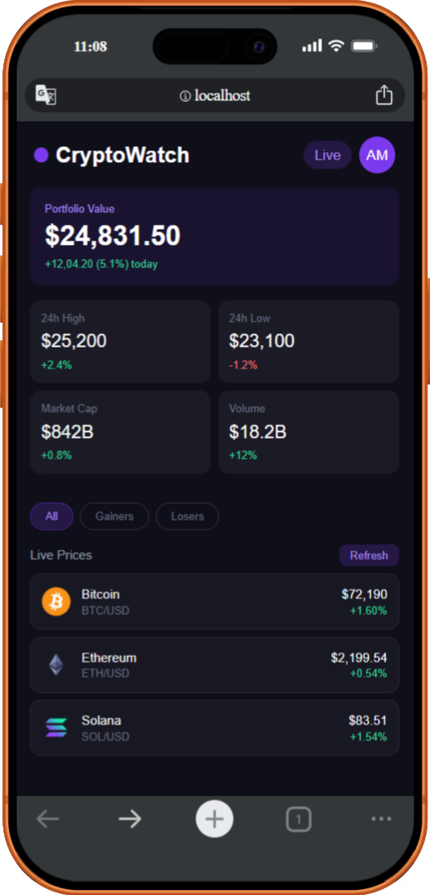

# UI05 — CryptoWatch Dashboard

A real-time cryptocurrency price tracker built with React.
Fetches live data from CoinGecko API using useEffect on mount.

## Output Screenshot




## Concepts Covered

- useEffect — API fetch on mount with [] dependency
- useState — 4 states (coins, loading, error, activeTab)
- Conditional rendering — loading / error / data states
- Props & destructuring — every component
- Children prop — Card wrapper
- Array.map() — stats + coins render
- Functions as props — onRetry (Refresh button)
- try/catch/finally — error handling
- Async/await inside useEffect
- Filter logic — tabs (all/gainers/losers)

---

## Folder Structure

```
src/
├── components/
│   ├── Navbar.jsx        # Top navigation bar
│   ├── HeroCard.jsx      # Portfolio value — hardcoded
│   ├── Card.jsx          # Reusable children wrapper
│   ├── StatsCard.jsx     # Reusable stat card (4x)
│   └── CoinCard.jsx      # Reusable coin row — API data
│
└── App.jsx               # States + useEffect + render
```

---

## Component Tree

```
App.jsx
│
├── Navbar.jsx
├── HeroCard.jsx
├── Card.jsx  ← children prop
│   └── StatsCard.jsx  (x4 — map se)
│
├── Tabs (App.jsx inline)
│
└── CoinCard.jsx  (x3 — map se — API data)
    ├── Bitcoin
    ├── Ethereum
    └── Solana
```

---

## States in App.jsx

```js
const [coins, setCoins]         = useState([])     // API data
const [loading, setLoading]     = useState(true)   // fetch ho rahi?
const [error, setError]         = useState(null)   // koi error?
const [activeTab, setActiveTab] = useState("all")  // selected tab
```

---

## API Details

```
Provider : CoinGecko (Free — No API key needed)

URL:
https://api.coingecko.com/api/v3/coins/markets
?vs_currency=usd
&ids=bitcoin,ethereum,solana
&order=market_cap_desc

Method : GET
Auth   : None required
```

### API Response Fields Used

```js
coin.id                          // key prop ke liye
coin.name                        // "Bitcoin"
coin.symbol                      // "btc"
coin.image                       // logo URL
coin.current_price               // 43250
coin.price_change_percentage_24h // 2.4
```


